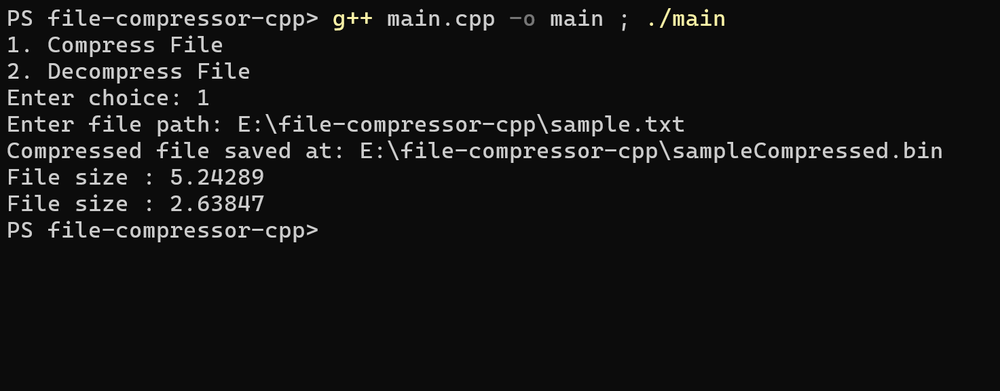
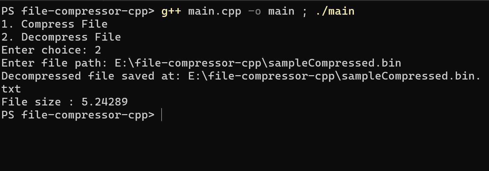

# Huffman File Compression and Decompression (C++)

This project implements a file compression and decompression system using Huffman Coding in C++. It reads a text file, compresses it into a binary format, and reconstructs the original file during decompression.

---

## Overview

Huffman Coding is a lossless data compression algorithm that assigns variable-length prefix codes to characters based on their frequencies. Characters with higher frequencies receive shorter codes, resulting in efficient compression.

---

## Screenshots

### Compression Output


### Decompression Output


---

## Features

- Builds a Huffman Tree using character frequencies  
- Generates optimal prefix codes  
- Encodes text into a compressed binary format  
- Stores frequency map for accurate decoding  
- Decodes compressed file back to original text  
- Displays file sizes before and after compression  

---

## File Structure
```
├── screenshots/
│   ├── image.png
│   ├── image2.png
├── main.cpp
├── README.md
```

---

## Working Principle

### 1. Frequency Calculation
The program reads the input file and calculates the frequency of each character using a hash map.

### 2. Huffman Tree Construction
A priority queue (min-heap) is used to build the Huffman Tree by repeatedly combining nodes with the lowest frequencies.

### 3. Code Generation
The tree is traversed to generate binary codes:
- Left edge represents `0`
- Right edge represents `1`

### 4. Encoding
The input text is converted into a binary string using the generated Huffman codes.

### 5. Writing Compressed File
The compressed file stores:
- The frequency map  
- Total number of encoded bits  
- Binary data packed into bytes  

### 6. Decoding
The frequency map is used to rebuild the Huffman Tree. The encoded bits are then decoded by traversing the tree to reconstruct the original text.

---

## Concepts Used

- Greedy Algorithms  
- Binary Trees  
- Priority Queue (Min Heap)  
- Bit Manipulation  
- File Handling (Text and Binary)  

---

## Compilation and Execution

### Compile

```bash
g++ main.cpp -o huffman
```

```bash
./huffman 
```
## Example Output


File size : 5.24289 MB (original)
File size : 2.63847 MB (compressed)
File size : 5.24289 MB (decoded)

---

## Notes

- Compression efficiency depends on the redundancy of the input data  
- The compressed file is stored in binary format and is not human-readable  
- The decoded output should match the original input exactly  

---

## Possible Improvements

- Support large files using streaming instead of full memory loading  
- Implement direct bit-level file writing for better efficiency  
- Add command-line arguments for flexible file input/output  
- Free dynamically allocated memory to prevent memory leaks  
- Improve error handling for invalid or corrupted files  

---

## Author

Jay Rathore